# 🍽️ Zomato Clone — DevSecOps & CI/CD Project

A full-stack Zomato-inspired food delivery application integrated with a **DevOps/DevSecOps pipeline** for automated build, containerization, deployment, security, monitoring, and logging.

## 🚀 Project Overview

This project demonstrates how a modern web application can be integrated with DevOps practices to create a more automated, secure, and observable deployment workflow.

The application is containerized using **Docker** and supported by a complete DevOps environment including **Jenkins, Prometheus, Grafana, Loki, Promtail, Nginx, and Docker Compose**.

## 🖥️ Application Preview

The Zomato Clone application provides a food discovery and restaurant browsing interface inspired by the Zomato platform.

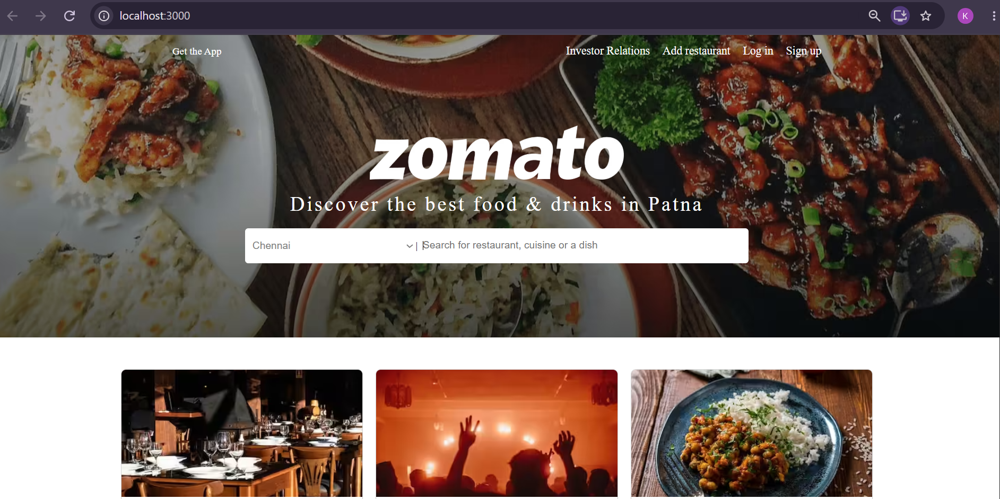

## 🛠️ Technologies Used

| Category | Technologies |
|---|---|
| Frontend | React.js, JavaScript, SCSS |
| Version Control | Git, GitHub |
| Containerization | Docker, Docker Compose |
| CI/CD | Jenkins |
| Code Quality / Security | SonarQube |
| Monitoring | Prometheus, Grafana |
| Logging | Loki, Promtail |
| Web Server / Reverse Proxy | Nginx |
| Scripting | PowerShell, Batch, Shell |
| Infrastructure Configuration | YAML |

## ✨ Key Features

* 🍔 Zomato-inspired food delivery interface
* 🐳 Docker-based application containerization
* 🔄 Jenkins-based CI/CD automation
* 🔍 SonarQube integration for code quality/security analysis
* 📊 Prometheus-based metrics collection
* 📈 Grafana dashboards for monitoring
* 📝 Loki and Promtail for centralized logging
* 🌐 Nginx configuration for web serving/reverse proxy
* 🧩 Docker Compose for managing multiple services
* 📁 Organized monitoring and infrastructure configuration
* 📜 Project documentation and DevOps viva questions

## 🔄 DevOps Pipeline

The project follows a DevOps workflow similar to:

```text
Developer
    ↓
Git / GitHub
    ↓
Jenkins CI/CD
    ↓
SonarQube
    ↓
OWASP Dependency Check
    ↓
Trivy Security Scan
    ↓
Docker Build
    ↓
Nexus Repository
    ↓
Trivy Image Scan
    ↓
Container Deployment
    ↓
Prometheus → Grafana
    ↓
Application
```

## 🐳 Docker

The application and supporting services are configured using Docker.

The repository includes:

* `Dockerfile`
* `docker-compose.yml`
* Jenkins Docker configuration
* Supporting service configurations

To start the configured services:

```bash
docker compose up -d
```

To check running containers:

```bash
docker ps
```

To stop the services:

```bash
docker compose down
```

## 🔧 Jenkins CI/CD

Jenkins is used to automate the complete CI/CD workflow.

The repository contains:

```text
jenkinsfile
jenkins/
```

The pipeline automates source-code checkout, code analysis, dependency installation, security scanning, Docker image build, image push, image scanning, and deployment.

### Jenkins Pipeline

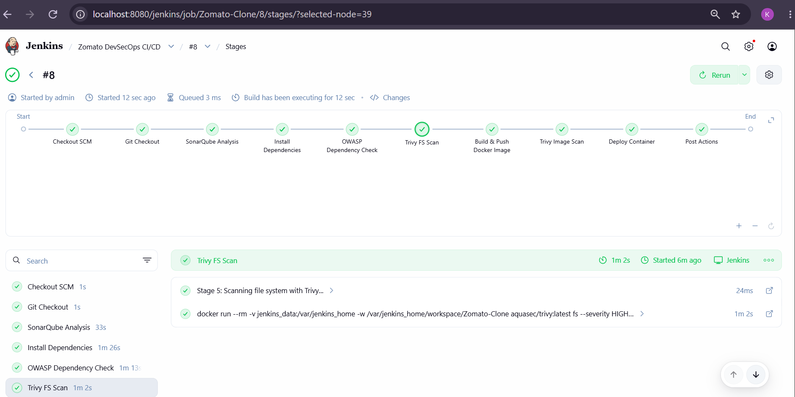

The pipeline executes the following stages:

```text
Checkout SCM
     ↓
Git Checkout
     ↓
SonarQube Analysis
     ↓
Install Dependencies
     ↓
OWASP Dependency Check
     ↓
Trivy FS Scan
     ↓
Build & Push Docker Image
     ↓
Trivy Image Scan
     ↓
Deploy Container
     ↓
Post Actions
```

## 🔍 SonarQube

SonarQube is integrated into the DevOps environment to support:

* Static code analysis
* Code quality checks
* Identification of potential issues
* Security-oriented code analysis

### SonarQube Dashboard

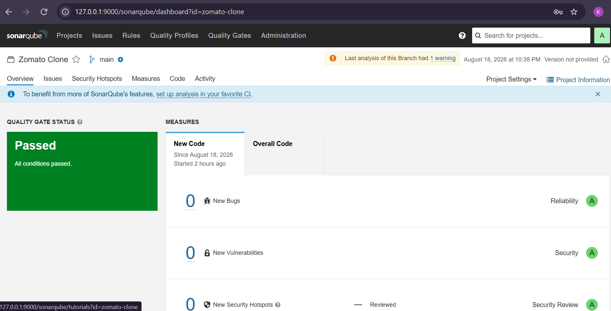

### SonarQube Analysis Activity

The SonarQube activity section provides an overview of the analyses performed during the project.

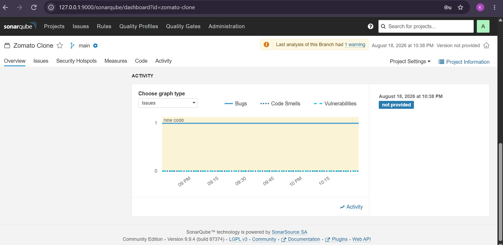

## 🔐 Security Scanning

Security scanning is integrated into the CI/CD pipeline to identify potential vulnerabilities before deployment.

The pipeline includes:

* OWASP Dependency Check
* Trivy File System Scan
* Trivy Docker Image Scan

## 📦 Nexus Repository

Nexus Repository Manager is used as a private Docker container registry for storing and managing Docker images.

The Zomato Clone Docker image was successfully built, pushed to the Nexus Docker registry, and pulled back from the registry.

### Nexus Dashboard

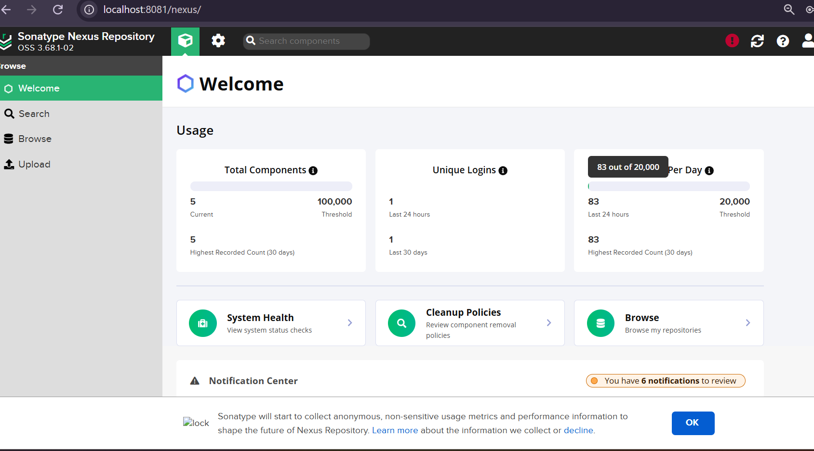

### Zomato Clone Docker Image in Nexus

The `zomato-clone` Docker image is stored inside the configured `docker-private` repository.

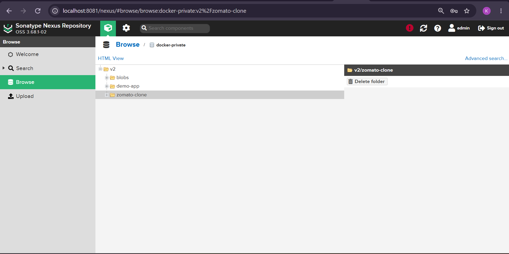

## 📊 Monitoring with Prometheus

Prometheus is configured for metrics collection and monitoring of the DevOps environment.

The repository contains monitoring configuration under:

```text
prometheus/
```

### Prometheus Services

Prometheus monitors multiple services in the DevOps environment.

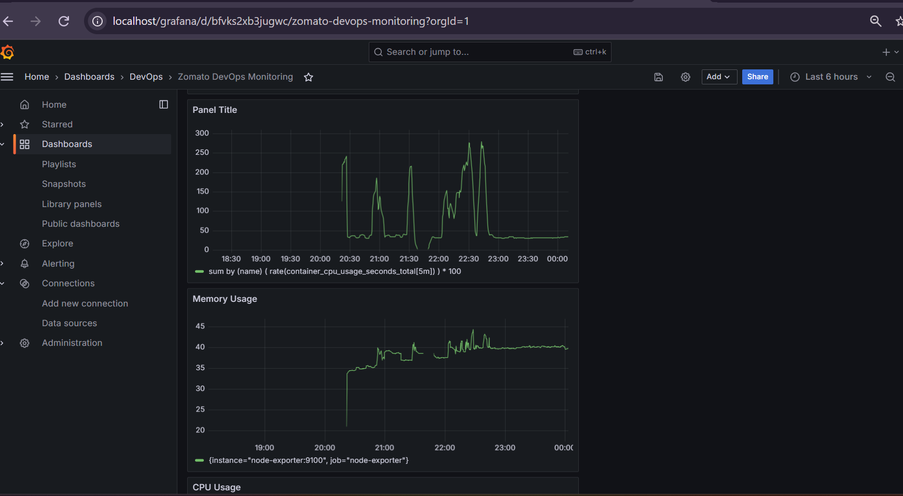

### Prometheus Targets

Prometheus targets provide an overview of the services being monitored.

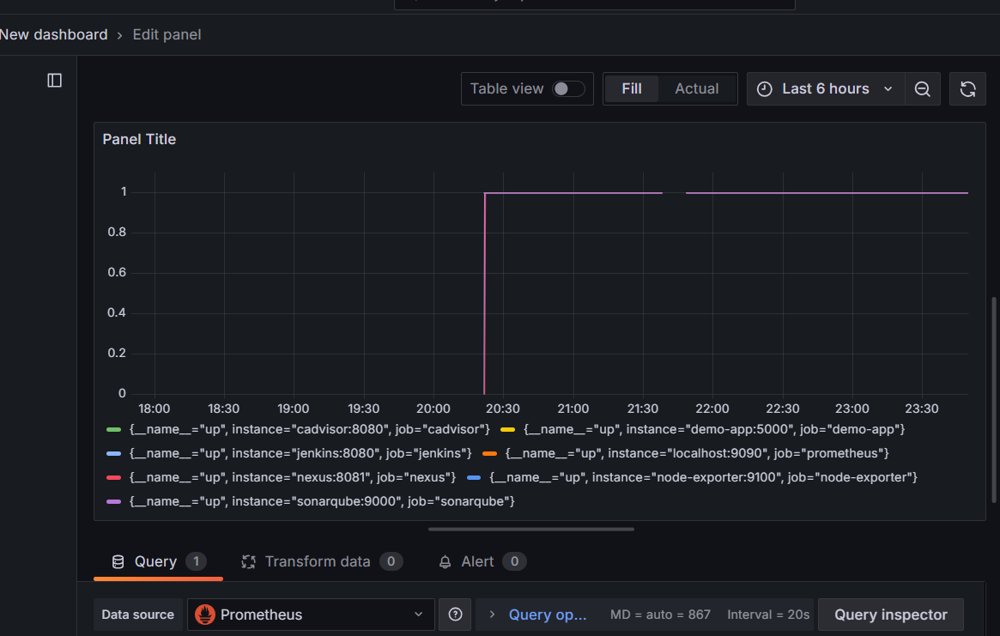

### Prometheus CPU Usage

CPU usage is monitored using Prometheus metrics collected from the system and containers.

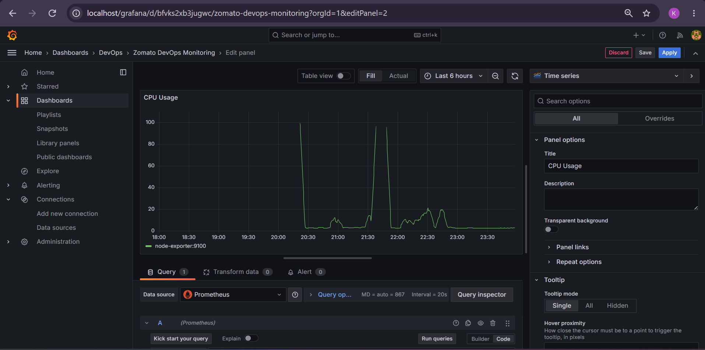

### Prometheus Memory Usage

Memory utilization is monitored over time using Prometheus metrics.

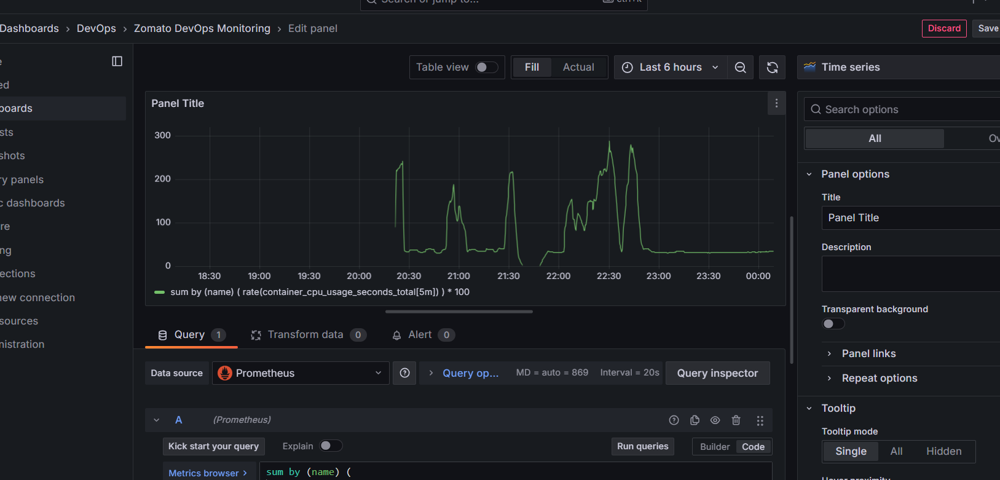

## 📈 Grafana

Grafana is used to visualize the metrics collected by Prometheus.

The monitoring environment uses Grafana dashboards to visualize system and container performance.

### Grafana & Prometheus Integration

Grafana is connected to Prometheus as a data source for visualization and monitoring.

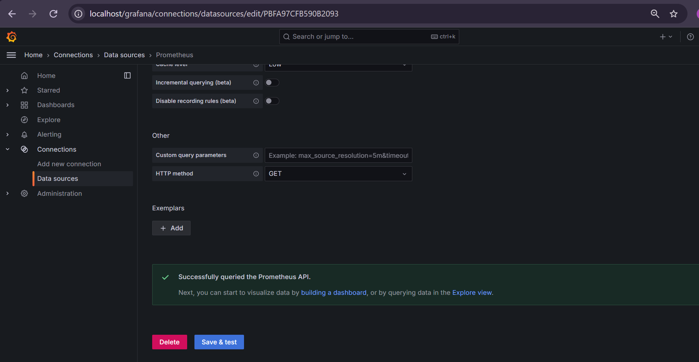

The Grafana monitoring environment can be used to visualize:

* CPU utilization
* Memory usage
* Container metrics
* Service availability
* System performance

## 📝 Centralized Logging

The project uses **Loki and Promtail** for log collection and centralized log management.

```text
Application / Containers
        ↓
     Promtail
        ↓
       Loki
        ↓
     Grafana
```

Configuration files:

```text
loki/
promtail/
```

## 🌐 Nginx

Nginx is included in the infrastructure configuration and can be used as a web server/reverse proxy in the deployment architecture.

Configuration:

```text
nginx/nginx.conf
```

## 📁 Project Structure

```text
zomato-devops-project/
│
├── grafana/
│   ├── dashboards/
│   └── provisioning/
│
├── jenkins/
│   ├── Dockerfile
│   └── jenkins.yaml
│
├── loki/
│   └── loki-config.yml
│
├── nginx/
│   └── nginx.conf
│
├── prometheus/
│   └── prometheus.yml
│
├── promtail/
│   └── promtail-config.yml
│
├── scripts/
│   ├── Dockerfile
│   └── init-nexus.sh
│
├── src/
│
├── Dockerfile
├── docker-compose.yml
├── Jenkinsfile
├── package.json
├── PROJECT_EXPLANATION.md
├── VIVA_QUESTIONS.md
├── run-project.bat
├── run-project.ps1
└── README.md
```

## ⚙️ Running the Application

### Prerequisites

Install the following:

* Node.js
* npm
* Git
* Docker
* Docker Compose

Check Node.js and npm:

```bash
node -v
npm -v
```

### Install Dependencies

```bash
npm install
```

### Run Development Server

```bash
npm start
```

The application can then be accessed locally through the development server.

## 🐳 Run with Docker Compose

Start the configured environment:

```bash
docker compose up -d
```

Check services:

```bash
docker compose ps
```

View logs:

```bash
docker compose logs -f
```

Stop the environment:

```bash
docker compose down
```

## 📚 Documentation

Additional project documentation is available in:

### Project Explanation

`PROJECT_EXPLANATION.md`

Contains detailed information about the project and its implementation.

### Viva Questions

`VIVA_QUESTIONS.md`

Contains questions and explanations useful for understanding and presenting the project.

## 🎯 Learning Objectives

This project was developed to gain practical understanding of:

* DevOps lifecycle
* CI/CD automation
* Docker containerization
* Jenkins pipelines
* Code quality and security analysis
* Infrastructure configuration
* Application monitoring
* Centralized logging
* Reverse proxy configuration
* Git and GitHub workflows

## 👩‍💻 Author

**Kunika Prajapat**

MCA | Aspiring DevOps / Cloud Engineer

GitHub: [Kunika1234](https://github.com/Kunika1234)

## ⭐ Project

If you find this project useful for learning DevOps and DevSecOps concepts, feel free to explore the repository.

---

**Built as a practical DevOps & DevSecOps learning project. 🚀**
